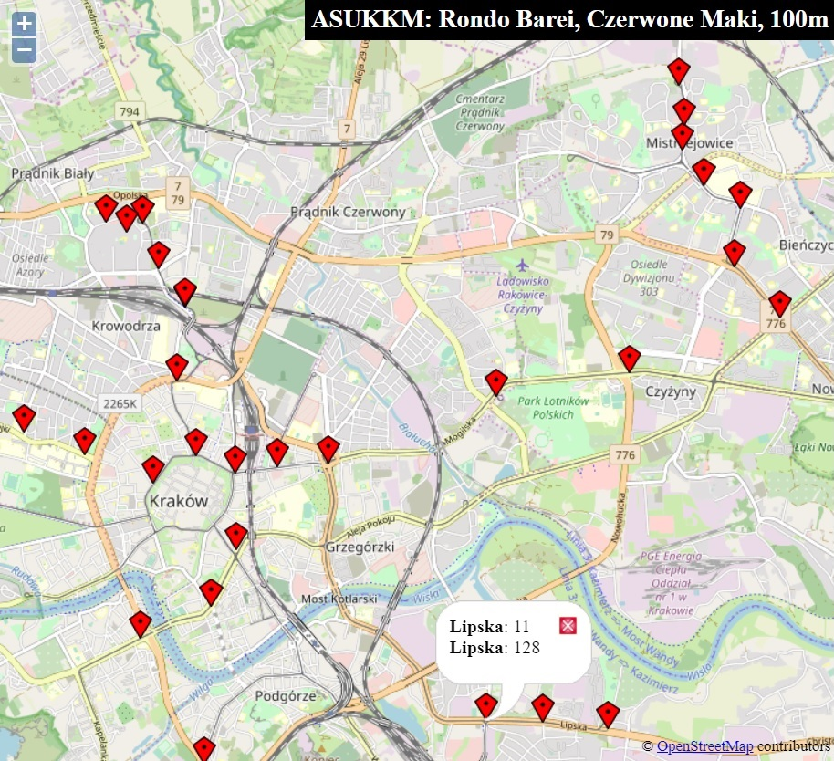

# ASUKKM
Search for locations that have direct KKM (MPK Kraków) bus/tram connections - needed when 2 people want to rent a flat and work in different parts of city (Kraków)

## Usage
Input:

- 2 target bus/tram stops
- distance between stops from which target stops can be rached directly
  - reasonable max value is 800m which is around 10 minutes of walking

Output:

- CLI listing
- points.js for map.html, later of which has OpenStreetMap with stops visualised (click to show stop names and lines)

## Under the hood

### Data sources
- StopsDB: Krakow TTSS - most doc from https://github.com/jacekkow/mpk-ttss
- LinesDB: rozklady.mpk.krakow.pl:
  - crude regexes on html
  - reverse engineered variant of base64 used in URLs to encode stop name

### "Algo"
Not so sophisticated bruteforce lookups:

1. Get lines for each target (input) stop (A and B)
2. Get all stops from which target stops can be reached directly (all stops of all lines from step 1)
3. For each stop that connects to target A check which stop that connects to target B is less than given distance away, add them to array
4. Remove duplicates
5. For each pair gather lines that connect to tagret stops and store data for map